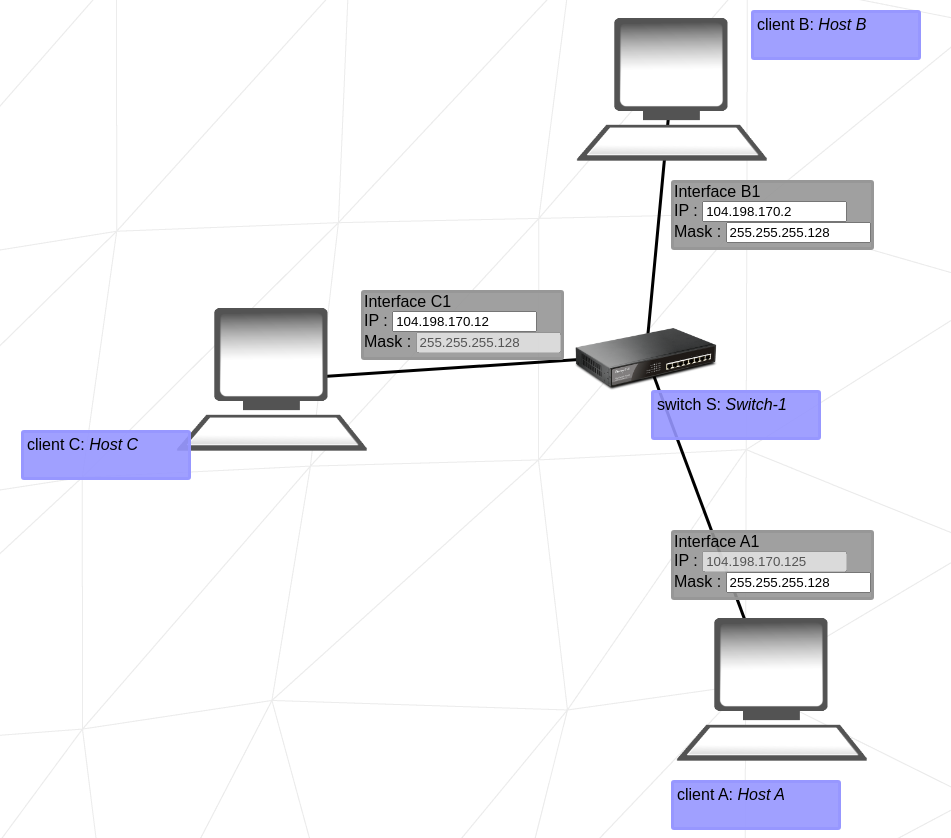

# Net Practice
This project have small-scale networks that are misconfigured. Our job is to configure them, so Computers can communicate between each other.

## Table of contents
* [What is an IP Address ?](#ip_address)
* [What is a Subnet Mask ?](#subnet_mask)
* [Level 1](#level_1)
* [Level 2](#level_2)
* [Level 3](#level_3)
* [Level 4](#level_4)
* [Level 5](#level_5)
* [Level 6](#level_6)
* [Level 7](#level_7)
* [Level 8](#level_8)
* [Level 9](#level_9)
* [Level 10](#level_10)

## What is an IP Address ?

## What is a Subnet Mask ?

## Level 1
 

## Level 2
 

## Level 3

## Level 4

## Level 5

## Level 6

## Level 7

## Level 8

## Level 9

## Level 10

